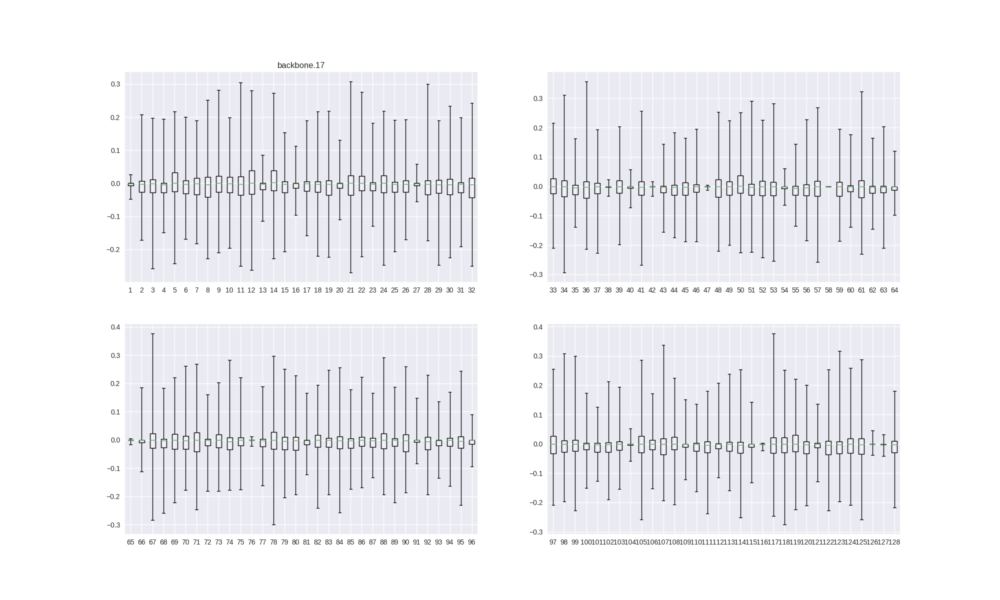
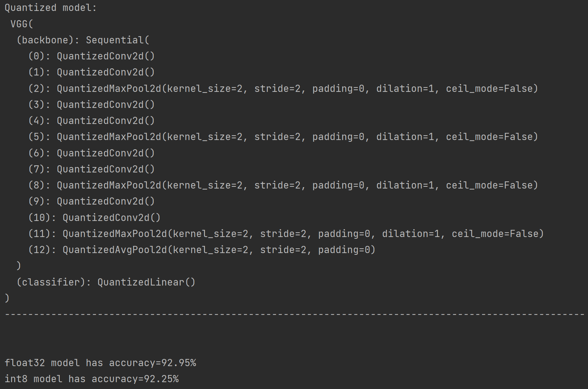

# Quantization Demo


### 1. The basics of linear quantization

The **linear quantization scheme**[1] enables efficient implementation of all arithmetic using only integer arithmetic operations on the quantized values by introducing an *affine mapping* of integers *q* to real numbers *r* using the formula:  
$$
r = S(q - Z)  \tag 1
$$
where, *S* and *Z* are constants, also called *quantization parameters*. 

The constant *S* is an arbitrary positive real number (like *r*), and constant *Z* is of the same type as quantized values *q*, which represents the real value 0 without losing any accuracy.

Given any real tensor *r*, and bit width *k*,we can quantized it to a int tensor *q*:
$$
\begin{align}
q &= clip(Z + round(\frac{r}{S}), q_{min}, q_{max})  \tag 2 \\ \\
q_{min} &= - 2^{k-1}   \\
q_{max} &= 2^{k-1} - 1 \\
\end{align}
$$
where *S* and *Z* can be calculated as:
$$
\begin{align}
S &= \frac{r_{max} - r_{min}}{q_{max} - q_{min}} \\ \\
Z &= q_{min} - round(\frac{r_{min}}{S})  \tag 3
\end{align}
$$


**Integer based matrix multiplication**

This section derives the formula of the quantized matrix multiplication:
$$
Y = W X + b \tag 4
$$
We can plug eq. (1) into eq. (2)，and solve for quantized *q_y*:
$$
\begin{align}
S_y(q_y - Z_y) &= S_w(q_w, Z_w) \cdot S_x(q_x - Z_x)  + S_b(q_b - Z_b) \\
		   q_y &= Z_y + \frac{S_x S_w}{S_y} (q_w - Z_w)(q_x - Z_x)  + S_b(q_b - Z_b) \\
		   q_y &= Z_y + \frac{S_x S_w}{S_y} (q_w q_x - Z_w q_x - Z_x q_w + Z_w Z_x) + \frac{S_b}{S_y}(q_b - Z_b) \tag 5
\end{align}
$$
If we set $Z_w = 0$，$Z_b = 0$, which means we use symmetrical quantization scheme on weights and bias, and also set $S_b = S_x S_w$， the above formula can be simplified further:
$$
q_y = Z_y + \frac{S_x S_w}{S_y} (q_w q_x - Z_x q_w + q_b) \tag 6
$$
Look at eq. (4), we can realize the fact that all operations are integer based arithmetic except the scaling factor $\frac{S_x S_w}{S_y}$. Empirically, the scale factor is always in the interval (0, 1), which can be expressed as fixed-point multiplication:
$$
\frac{S_x S_w}{S_y} = 2^{-n} M_0, \quad where M_0 \in [0.5, 1) \tag 7
$$


**Integer based convolution**

Eq. (6) can be easily extended to quantized convolution, since both matmul and conv are linear:
$$
q_y = Z_y + \frac{S_x S_w}{S_y} (Linear[q_w, q_x] - Linear[Z_x, q_w] + q_b) \\
q_y = Z_y + \frac{S_x S_w}{S_y} (Conv[q_w, q_x] - Conv[Z_x, q_w] + q_b)
\tag 8
$$


### 2. Quantize Weight

It turns out that weights usually follows Gaussion distribution and thus it's symmetrically quantized. Since the value range between different channels may be significant large, thus Per-Channel quantization scheme is used in this case.

```python
# Run the script to see how to quantize weight and plot distributions
python quantize_weight.py
```




### 3. Activation  

Calibrate activations from all layers to collect statistics of the input and output tensor. See the example script for how to use it. `python calibration.py`.


### 4.  INT8 Quantization Model

The demo script `quantize_model.py` demonstrate the full steps of quantizing a whole VGG classification model with accuracy drop less than 0.2%.

```python
python quantize_model.py
```


